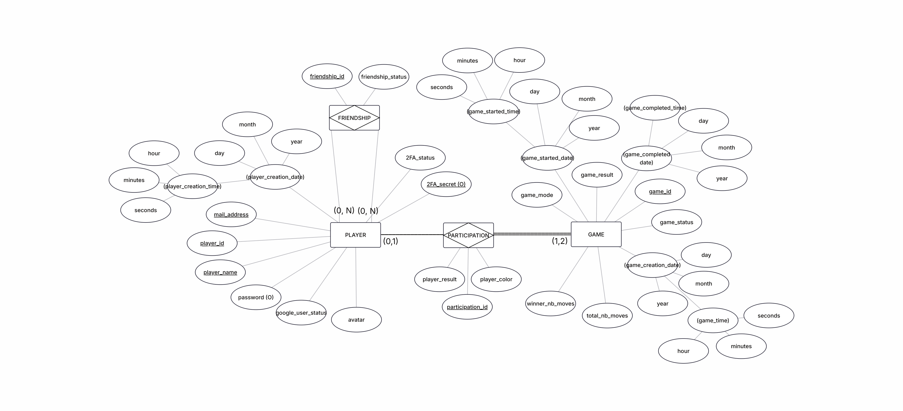
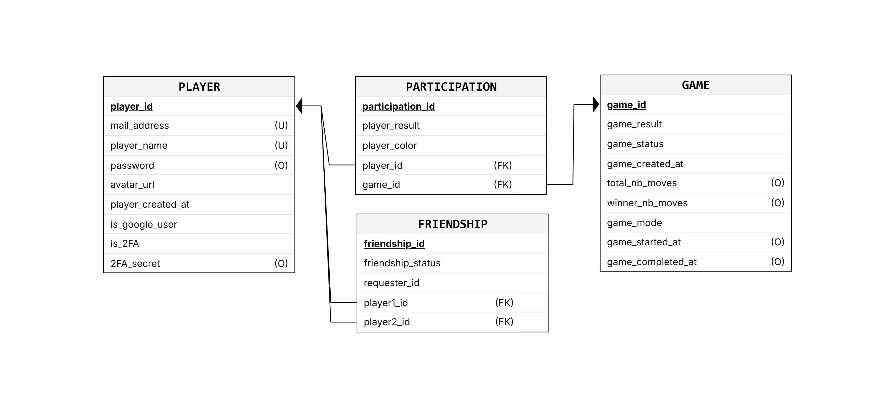

# _This project has been created as part of the 42 curriculum by aistierl, daavril, kcharbon, ychattou._

# Chess War

## Description

Chess War is a real-time multiplayer gaming platform built around online chess, private chat, and social features in a single web application. Its goal is to provide a seamless competitive experience with live synchronization, while also showcasing a secure and production-oriented architecture.

Key features include:

- Real-time chess matches with WebSocket synchronization.
- Private direct messages between friends.
- Account management with local auth, Google OAuth, refresh tokens, and 2FA.
- Player statistics, leaderboard, and dashboard widgets.
- Security-focused infrastructure with Vault, NGINX, and a WAF.
- Dockerized local and production deployment.

> [!WARNING]
> The project also contains a Tic-Tac-Toe bot mode and a compliance section in the original documentation, but their exact scope and ownership are not fully documented in the repository. The README keeps them under features, but some implementation details remain summarized rather than exhaustively traced.

## Instructions

### Prerequisites

- Docker and Docker Compose.
- Node.js 20 or newer for local tooling and package management.
- PostgreSQL 15 and Redis are used by the stack, but they are started through Docker Compose in the default workflow.
- A filled `.env` file at the repository root.
- The `secrets/` directory available for Docker Compose.

### Environment Setup

1. Copy or create the root `.env` file with all required variables.
2. Make sure the secret files under `secrets/` are present.
3. If you need a local-only reset, stop the stack first and clear the database volume/data according to your local setup.

> [!WARNING]
> The repository documents that `.env` and `secrets/` are required, but it does not provide a complete, versioned example file in the README itself. Exact values and any optional variables should be confirmed from the project files before deployment.

### Run

1. Start the stack:

   ```bash
   docker compose up
   ```

2. Open the application in your browser at:

   ```text
   https://localhost
   ```

3. Create an account with the registration flow, or use Google login if configured.
4. After login, the dashboard provides access to stats, matches, friends, chat, and game features.

### Stop

```bash
docker compose down
```

## Resources

Classic references used for the project:

- React documentation: react.dev
- NestJS documentation: docs.nestjs.com
- Drizzle ORM documentation: orm.drizzle.team
- PostgreSQL documentation: postgresql.org/docs
- Redis documentation: redis.io/docs
- Socket.IO documentation: socket.io/docs
- Passport.js documentation: passportjs.org
- OWASP Core Rule Set and ModSecurity documentation
- HashiCorp Vault documentation
- Docker and Docker Compose documentation
- Bcrypt package documentation on npm
- Speakeasy package documentation on npm
- Community support and tutorials from Stack Overflow, Reddit, OpenClassrooms, Scrimba, and YouTube

AI usage:

> [!WARNING]
> The repository does not document a formal AI usage policy or a precise breakdown of which tasks were assisted by AI. For evaluation purposes, this README should be completed with the actual usage scope, for example: drafting documentation, refining wording, structuring sections, or helping review technical descriptions. If AI was not used, say so explicitly.

## Team Information

### Aïcha:

- Roles: Product Owner (Data engineer, Backend Lead, Security contributor)
- Responsibilities: Product direction and backlog prioritization, database design and data quality ownership, backend architecture and API coordination, and security support for authentication/token lifecycle and secret management.

### Kalvin:

- Roles: Project Management (Security/Infra Lead, Backend contributor)
- Responsibilities: Project coordination and delivery follow-up, security and infrastructure hardening (WAF/ModSecurity, Vault integration), 2FA feature implementation, and backend ownership of users/friendship flows.

### Daryl:

- Roles: Tech Lead (Frontend Lead, DevOps coordination)
- Responsibilities: Stack decision-making, GitHub repository setup and coordination, full frontend development, UI/UX design, Docker containerization support.


### Ylan:

- Roles: Developper (Gameplay Developer, Frontend contributor)
- Responsibilities: Core chess gameplay implementation (rules, algorithm, board rendering), frontend development of room creation and matchmaking interfaces, and gameplay-focused UI integration.

## Project Management

The team organized the work through task distribution, regular meetings, testing sessions, and code review. Meetings were held on school premises at least once a week, sometimes up to three times, to review code, identify issues, test features, and adjust task allocation.

**Tools and channels used**:

- GitHub Issues for task tracking and coordination.
- Discord for communication.
- GitHub Actions for linting and build validation.
- Husky pre-commit hooks for code quality enforcement.

## Technical Stack

| Layer               | Technology                                      | Notes                                                                                            |
| ------------------- | ----------------------------------------------- | ------------------------------------------------------------------------------------------------ |
| Language            | TypeScript                                      | Used across frontend and backend for type safety and shared developer experience.                |
| Frontend            | React 19, Vite, TailwindCSS                     | React is used for the SPA; Vite provides fast builds; Tailwind supports consistent themeable UI. |
| Backend             | NestJS 11                                       | Chosen for structured modules, dependency injection, and WebSocket support.                      |
| ORM                 | Drizzle ORM                                     | Lightweight SQL-first ORM with migrations, well suited to explicit relational modeling.          |
| Database            | PostgreSQL 15                                   | Chosen for strong relational guarantees, constraints, and game/statistics queries.               |
| Cache / Sessions    | Redis                                           | Used for refresh tokens, rate limits, and temporary auth/security state.                         |
| Auth                | Passport.js, JWT, Google OAuth 2.0              | Supports local auth, OAuth, access/refresh tokens, and protected routes.                         |
| 2FA                 | speakeasy                                       | Implements TOTP flows for secure login challenges and disable flows.                             |
| Realtime            | Socket.IO, @nestjs/websockets, socket.io-client | Supports live game and chat updates with authenticated namespaces.                               |
| Password hashing    | bcrypt                                          | Standard password hashing for local accounts.                                                    |
| Reverse proxy / TLS | NGINX                                           | Terminates HTTPS and routes `/api/*` traffic to the backend.                                     |
| Security            | ModSecurity, OWASP CRS, HashiCorp Vault         | Adds WAF protection and centralized secret management.                                           |
| Containerization    | Docker, Docker Compose                          | Used to orchestrate the full stack locally and in production-like setups.                        |

## Database Schema

The data model is relational and centered on players, games, participations, and friendships.





Main entities and relationships:

- Players store authentication and profile data such as pseudo, email, avatar, and auth metadata.
- Games store match metadata, status, result, timing, and mode information.
- Participations link players to games and record the assigned color and outcome.
- Friendships store symmetric social relations and pending requests.

Key rules enforced by the model:

- A player can participate in only one active game at a time.
- A game can involve one or two unique players depending on its state.
- Friendship relations are symmetrical and non-reflexive.
- Default avatars are assigned to new users.
- Google accounts do not require a local password and cannot enable local 2FA.

> [!WARNING]
> The README includes the database diagrams, but the exact column-by-column type inventory is not reproduced here. Refer to the Drizzle schema and migrations for the authoritative definition of fields and SQL types.

## Feature List

### Core Application

| Feature               | Description                                                                  | Main contributors |
| --------------------- | ---------------------------------------------------------------------------- | ----------------- |
| SPA architecture      | Full-stack single-page application with a React frontend and NestJS backend. | Daryl, Aïcha      |
| Dockerized deployment | Local and production-like orchestration through Docker Compose.              | Daryl, Kalvin     |
| Route protection      | Private routes, public-only routes, and auth-aware navigation.               | Daryl             |

### Authentication & Security

| Feature                | Description                                                        | Main contributors |
| ---------------------- | ------------------------------------------------------------------ | ----------------- |
| Registration and login | Local signup/login with pseudo, email, and password.               | Aïcha, Daryl      |
| Google OAuth           | OAuth login and signup flow with Google accounts.                  | Aïcha, Daryl      |
| Token lifecycle        | Access token, refresh token, logout, and refresh validation.       | Aïcha             |
| 2FA                    | TOTP activation, challenge flow, and secure disable flow.          | Kalvin, Aïcha     |
| Account deletion       | Deletion flow with cleanup and token revocation.                   | Daryl, Aïcha      |
| Secret management      | Vault-based secret bootstrap and sensitive configuration handling. | Kalvin            |
| WAF / edge security    | NGINX, ModSecurity, and OWASP CRS protection layer.                | Kalvin            |

### Social and Profile

| Feature            | Description                                                     | Main contributors    |
| ------------------ | --------------------------------------------------------------- | -------------------- |
| Profile management | Edit pseudo, email, password, and avatar with validation rules. | Daryl, Aïcha         |
| Friendship system  | Send, accept, remove, and list friend relations.                | Kalvin, Aïcha, Daryl |
| User search        | Partial username search for social discovery.                   | Daryl                |

### Chess and Realtime

| Feature            | Description                                                     | Main contributors |
| ------------------ | --------------------------------------------------------------- | ----------------- |
| Lobby creation     | Create a game lobby with color and mode selection.              | Ylan, Aïcha       |
| Matchmaking        | Join or cancel pending lobbies and auto-start games.            | Ylan, Aïcha       |
| Online gameplay    | Full chessboard logic, legal moves, and turn enforcement.       | Ylan              |
| Game persistence   | Persist match outcomes, move counts, and participation records. | Aïcha             |
| Realtime game sync | WebSocket game state synchronization and move broadcasts.       | Aïcha, Ylan       |
| Chat               | Friend-based private messaging with live updates.               | Aïcha, Daryl      |

### Dashboard and Extra Game Mode

| Feature          | Description                                                 | Main contributors |
| ---------------- | ----------------------------------------------------------- | ----------------- |
| Dashboard stats  | Wins, losses, draws, winrate, streaks, and match history.   | Daryl, Aïcha      |
| Ranking widgets  | Leaderboard, recent matches, and graph-based stats display. | Daryl             |
| Day / Night mode | Global theme system applied across the full app.            | Daryl             |
| Tic-Tac-Toe bot  | Puzzle page with easy and hard AI difficulty levels.        | Ylan              |

## Modules

Points are counted with the required rule: Major = 2 points, Minor = 1 point.

### Mandatory Modules

| Module                          | Points | Implementation                                                  | Contributors         |
| ------------------------------- | ------ | --------------------------------------------------------------- | -------------------- |
| Frontend + backend frameworks   | 2      | React SPA paired with a NestJS API.                             | Daryl, Aïcha         |
| Real-time features              | 2      | Socket.IO namespaces for game and chat.                         | Aïcha, Ylan          |
| User interactions               | 2      | Friendship, profile, dashboard, and social workflows.           | Daryl, Kalvin, Aïcha |
| ORM                             | 1      | Drizzle schema, migrations, and relational queries.             | Aïcha                |
| Standard user management & auth | 2      | Local auth, JWT, refresh, Google OAuth, and protected routes.   | Aïcha, Daryl         |
| Game statistics & match history | 2      | Aggregated stats and recent match display.                      | Daryl, Aïcha         |
| OAuth 2.0 (Google)              | 1      | Passport Google strategy and token handling.                    | Aïcha, Daryl         |
| 2FA                             | 1      | TOTP challenge flow and secure enable/disable paths.            | Kalvin, Aïcha        |
| AI opponent                     | 2      | Tic-Tac-Toe bot with two difficulty levels.                     | Ylan                 |
| WAF / Vault                     | 2      | ModSecurity/OWASP CRS edge protection and Vault-backed secrets. | Kalvin               |
| Complete web-based chess game   | 2      | Legal move handling, board rendering, and match flow.           | Ylan                 |
| Remote multiplayer              | 2      | WebSocket game state synchronization and online play.           | Aïcha, Ylan          |
| Game customization options      | 1      | Color choice, game mode, and time controls.                     | Ylan, Aïcha          |
| Gamification system             | 1      | Stats, streaks, leaderboard, and progress feedback.             | Daryl, Aïcha         |

| Total              | Points |
| ------------------ | ------ |
| Mandatory subtotal | 23     |

### Custom Modules of Choice

| Module                | Points | Why it was chosen                                                            | Implementation                                                                         | Contributors |
| --------------------- | ------ | ---------------------------------------------------------------------------- | -------------------------------------------------------------------------------------- | ------------ |
| Global Day/Night mode | 2      | Improves accessibility and long-session comfort while touching the whole UI. | Central theme state, theme tokens, and consistent styling across pages and components. | Daryl        |
| Dashboard             | 1      | Gives the player an immediate summary of progress and competitiveness.       | Stats aggregation, leaderboard queries, and chart-based visualization.                 | Daryl, Aïcha |

| Total           | Points |
| --------------- | ------ |
| Custom subtotal | 3      |
| Grand total     | 26     |

## Individual Contributions

### Daryl — Tech Lead (Frontend Lead, DevOps coordination)

Daryl led the entire frontend of Chess War, from architecture to pixel-level polish. He designed and built every page of the application — login, signup, dashboard, profile, friends, game, tournament, chat — along with all their associated logic: form validation, route guards (public/private routes), auth context and hook (`useAuth`), token lifecycle handling, and API integration against the NestJS backend.

He implemented a clean separation of concerns across the frontend, with reusable components (`Header`, `SideBar`, `Search`, `StatsCards`, `EloGraph`, `LastMatches`, `LeaderBoard`, `Achievement`, `TournamentHistory`, `DailyPuzzle`), typed API calls, and custom hooks (`useFriends`). The sidebar navigation, profile editing flow (including 2FA QR activation and removal), friend search with debounce, and account deletion confirmation modal were all built and polished by him.

On the infrastructure side, Daryl set up the GitHub repository and put in place a CI pipeline using GitHub Actions for linting and build validation, along with Husky pre-commit hooks to enforce code quality standards across the team. He also handled the Docker containerization of the frontend service and contributed to the overall `docker-compose` orchestration alongside the team.

---

### Aïcha — Product Owner (Data Engineer, Backend Lead, Security contributor)

Aïcha was in charge of the database design and management, Drizzle ORM and Redis cache implementation, backend microservice-based architecture, authentication features (including token lifecycle and Google OAuth), and game-related backend and WebSocket integration.

---

### Kalvin — Project Management (Security/Infra Lead, Backend contributor)

Kalvin was responsible for backend hardening: WAF, ModSecurity, Vault integration for secrets management, 2FA authentication feature, password hashing and salt. He also worked on users and friendship-related backend and WebSocket integration.

---

### Ylan — Developer (Gameplay Developer, Frontend contributor)

Ylan took care of the chess gameplay implementation (frontend algorithm and rendering), and the frontend rendering of lobby creation and matchmaking interfaces.

---

> **Note:** Everyone took part in the testing phases and code reviews. Meetings were held on school premises at least once a week (up to three times) for code review, testing, issue identification, and task distribution. GitHub Issues and Discord were used for project management and communication.
